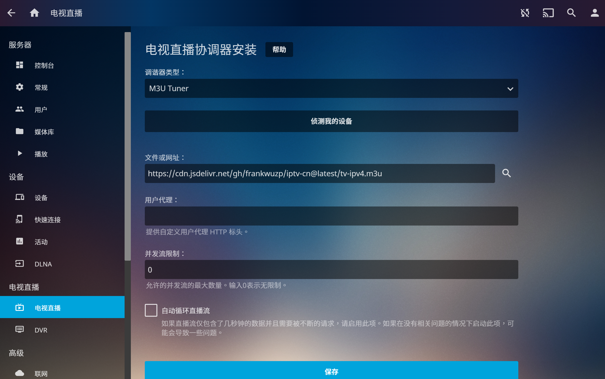
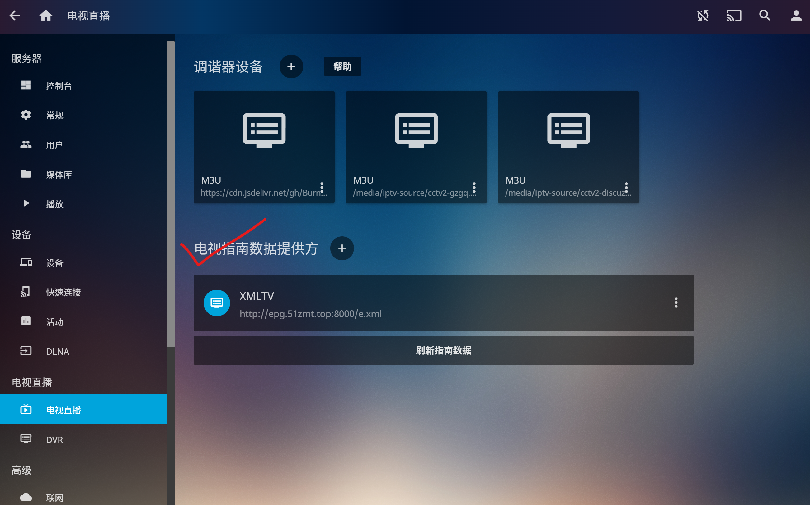

# iptv-cn
## 简介

亲测境内可用的 IPTV 资源，适用于 Jellyfin 的电视直播资源

## 如何使用

## Channel lists

- **Github**

  `https://raw.githubusercontent.com/frankwuzp/iptv-cn/main/tv-ipv4.m3u`

- **jsDelivr CDN** (optimized for mainland users)

  `https://cdn.jsdelivr.net/gh/frankwuzp/iptv-cn@latest/tv-ipv4.m3u`

可保存本仓库的 `tv-ipv4.m3u` 文件，或将以上网址（二选一）填入 Jellyfin 的电视直播协调器：

## Guide file (EPG)

- **Github**
  `https://raw.githubusercontent.com/BurningC4/Chinese-IPTV/master/guide.xml`
- **jsDelivr CDN (optimized for mainland users)**
  `https://cdn.jsdelivr.net/gh/BurningC4/Chinese-IPTV@master/guide.xml`

## 来源

- [BurningC4/Chinese-IPTV](https://github.com/BurningC4/Chinese-IPTV)
- [国内高清直播live - TV001](http://www.tv001.vip/forum.php?mod=viewthread&tid=3)
- [广东移动某河全套 - 恩山无线论坛](https://www.right.com.cn/forum/thread-6809023-1-1.html)

**感谢开放的互联网！🎉🎉🎉**

## Changelog

- 211121 init
