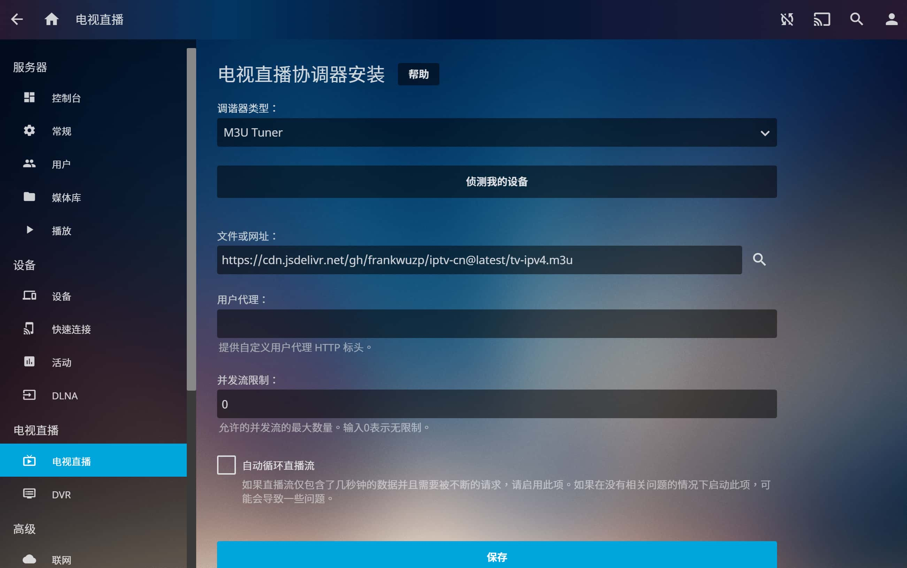
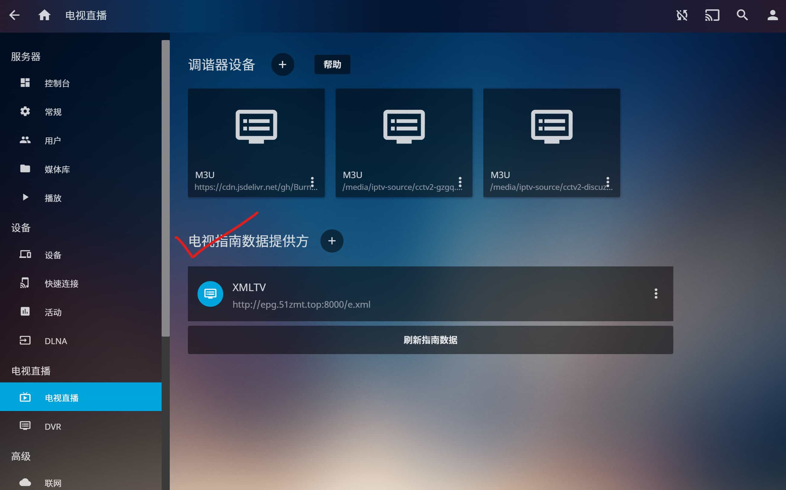

# iptv-cn

## 简介

亲测 **广东** 可用的 IPTV 资源，适用于Jellyfin 的电视直播。

## 如何使用

### 文件说明

- `tv-ipv4-cn` => 境内通用 `m3u` 文件

- ~~`tv-ipv4-gd` => 广东省内使用，优选 ✅~~

> 20211126 测试结果：`tv-ipv4-gd` 无法播放，请使用 `tv-ipv4-cn` 或 `tv-ipv4-cmcc`

- `tv-ipv4-cmcc` => 211126 新增的移动信号源，亲测可用 ✅

- `tv-ipv4-old` => 参考 [BurningC4](https://github.com/BurningC4/Chinese-IPTV) 的仓库，两年前的原始数据，部分可用，存在延迟和卡顿

- `guide.xml` => 由 `get-epg.py` 抓取数据并生成，通过 Actions 每天凌晨 1 点和 6 点自动更新

- `requirements.txt` => Python 程序 `get-epg.py` 的依赖包
### Channel lists (以广东为例)

- **Github**

  `https://raw.githubusercontent.com/frankwuzp/iptv-cn/main/tv-ipv4-cmcc.m3u`

- **jsDelivr CDN** (CDN 加速，大陆用户可选用)

  `https://cdn.jsdelivr.net/gh/frankwuzp/iptv-cn@latest/tv-ipv4-cmcc.m3u`

可保存本仓库的 `tv-ipv4-cmcc.m3u` 文件，或将以上网址（二选一）填入 Jellyfin 的电视直播协调器：

### Guide file (四选一)

- **某神秘大神版**

  `http://epg.51zmt.top:8000/e.xml`

- **Github**

  `https://raw.githubusercontent.com/frankwuzp/iptv-cn/main/guide.xml`

- **jsDelivr CDN (optimized for mainland users)**

  `https://cdn.jsdelivr.net/gh/frankwuzp/iptv-cn@latest/guide.xml`

- **iptv-org**
  
  `https://iptv-org.github.io/epg/guides/cn/tv.cctv.com.epg.xml`

## Ref

- [BurningC4/Chinese-IPTV](https://github.com/BurningC4/Chinese-IPTV)
- [SoPudge/kodi_iptv_epg](https://github.com/SoPudge/kodi_iptv_epg)
- [BurningC4/getepg](https://github.com/BurningC4/getepg)
- [3mile/cctv_api_get_EPG](https://github.com/3mile/cctv_api_get_EPG)
- [国内高清直播live - TV001](http://www.tv001.vip/forum.php?mod=viewthread&tid=3)
- [广东移动某河全套 - 恩山无线论坛](https://www.right.com.cn/forum/thread-6809023-1-1.html)

**感谢开放的互联网！🎉🎉🎉**

## Changelog

- 211126 备注不可使用的直播源，新增移动信号源
- 211123 解决更新 epg 时不能删除旧内容的问题 & 补充一个新的 epg 源
- 211122 新增 EPG 指南文件 `guide.xml`，并实现自动更新(每天凌晨1点、6点)
- 211122 分为国内通用版、广东省内专用版
- 211121 init
